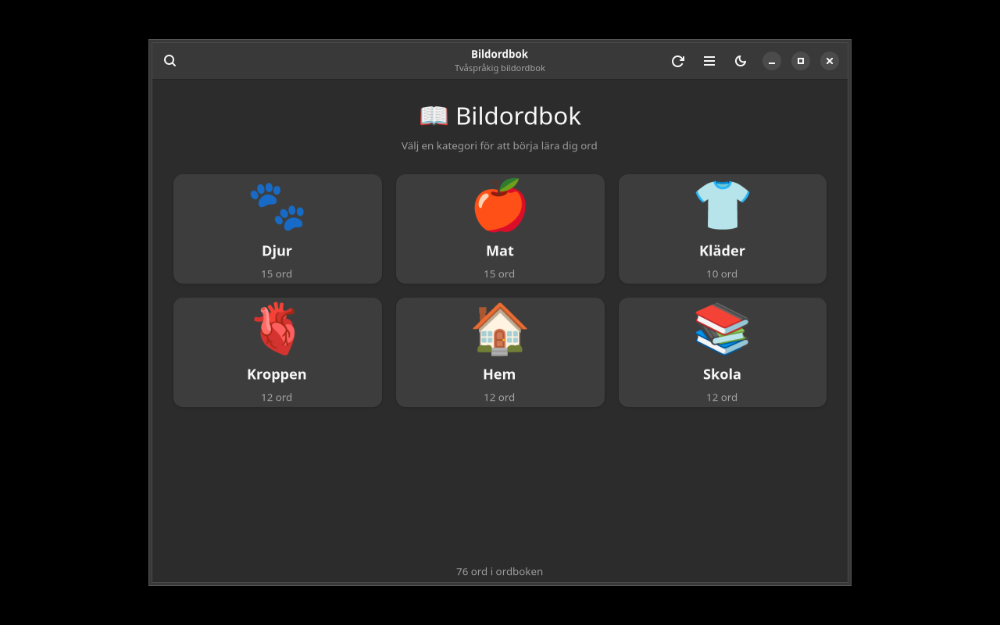

# Bildordbok

[](https://github.com/yeager/bildordbok/releases)
[](https://www.gnu.org/licenses/gpl-3.0)
[](https://www.transifex.com/danielnylander/bildordbok/)

Bilingual picture dictionary with text-to-speech — GTK4/Adwaita.

> **For:** Children and adults with developmental language disorder (DLD), autism, intellectual disabilities, and newcomers learning Swedish. Visual support with images, text, and TTS in two languages.



## Features

- **6 categories** — Animals, Food, Clothes, Body, Home, School
- **80+ words** with images and text in Swedish + English
- **ARASAAC pictograms** — automatic download of free pictograms from [ARASAAC](https://arasaac.org)
- **Text-to-speech** in both languages (via espeak-ng)
- **Spaced repetition** flashcards for effective learning
- **Search** — quickly find words across categories
- **Dark/light theme** toggle

## Installation

### Debian/Ubuntu

```bash
echo "deb [signed-by=/usr/share/keyrings/yeager-keyring.gpg] https://yeager.github.io/debian-repo stable main" | sudo tee /etc/apt/sources.list.d/yeager.list
curl -fsSL https://yeager.github.io/debian-repo/yeager-keyring.gpg | sudo tee /usr/share/keyrings/yeager-keyring.gpg > /dev/null
sudo apt update && sudo apt install bildordbok
```

### Fedora/openSUSE

```bash
sudo dnf config-manager --add-repo https://yeager.github.io/rpm-repo/yeager.repo
sudo dnf install bildordbok
```

### From source

```bash
git clone https://github.com/yeager/bildordbok.git
cd bildordbok && pip install -e .
bildordbok
```

## ARASAAC Attribution

Pictographic symbols © Gobierno de Aragón, created by Sergio Palao for [ARASAAC](https://arasaac.org), distributed under [CC BY-NC-SA 4.0](https://creativecommons.org/licenses/by-nc-sa/4.0/).

## Translation

Help translate on [Transifex](https://www.transifex.com/danielnylander/bildordbok/).

## License

GPL-3.0-or-later — see [LICENSE](LICENSE) for details.

## Author

**Daniel Nylander** — [danielnylander.se](https://danielnylander.se)
